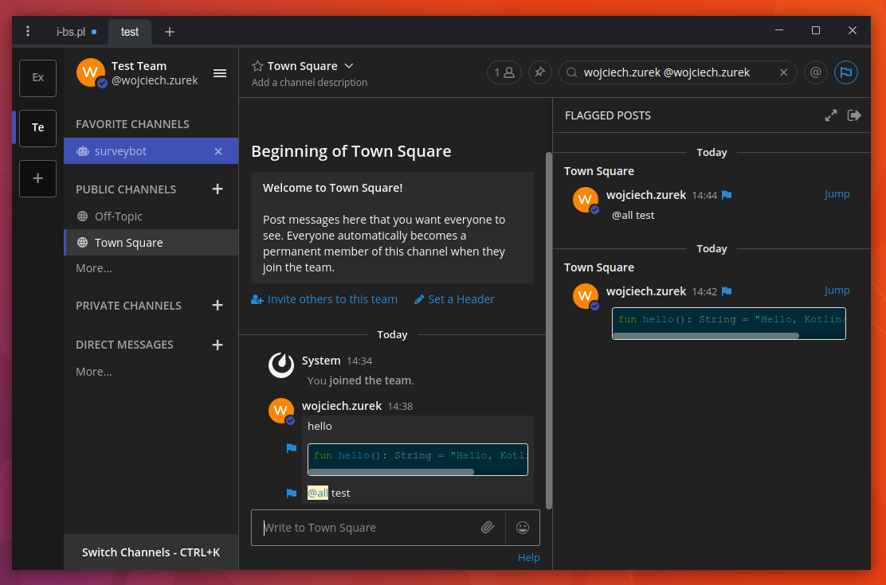

# The Material Dark Indigo Mattermost Theme

* Open Mattermost
* Account Settings
* Display
* Custom Theme
* Paste the code

```json
{"sidebarBg":"#212121","sidebarText":"#ffffff","sidebarUnreadText":"#ffffff","sidebarTextHoverBg":"#3f51b5","sidebarTextActiveBorder":"#3f51b5","sidebarTextActiveColor":"#ffffff","sidebarHeaderBg":"#212121","sidebarHeaderTextColor":"#ffffff","onlineIndicator":"#3f51b5","awayIndicator":"#e0b333","dndIndicator":"#f74343","mentionBj":"#ffffff","mentionColor":"#ffffff","centerChannelBg":"#212121","centerChannelColor":"#f7f3f3","newMessageSeparator":"#f80","linkColor":"#2389d7","buttonBg":"#26a970","buttonColor":"#ffffff","errorTextColor":"#fd5960","mentionHighlightBg":"#fff2bb","mentionHighlightLink":"#2f81b7","codeTheme":"solarized-dark","mentionBg":"#3F51B5"}
```

* Save

# Screenshot


